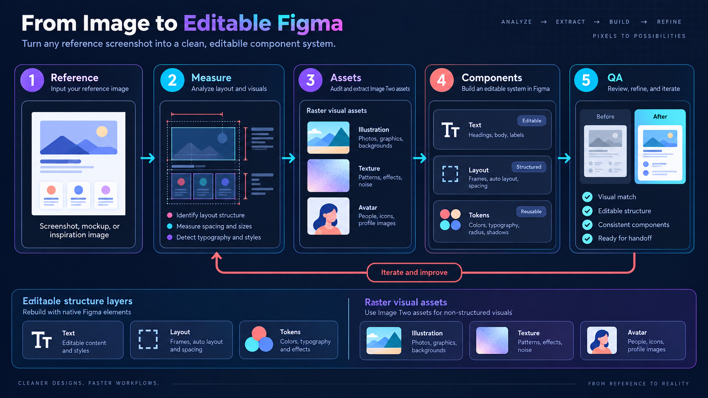

# Image to Editable Figma

将参考截图、PNG 或 SVG 重建为高保真、分层、可编辑的 Figma 组件系统。



## 这个 skill 解决什么问题

`image-to-editable-figma` 把“看起来像一张图”的交付，拆成真正可维护的设计文件：文本仍是 Figma 文本，容器和布局使用原生图层，重复区域使用组件实例，头像、插画、纹理等非结构性视觉作为独立图片素材导入。这样可以修改文案、替换素材、调整状态和复用组件，而不需要重新编辑整张截图。

## 工作流

1. **理解设计**：描述受众、页面类型和视觉语言，并记录设计变化度、动效强度、视觉密度。
2. **读取与测量**：建立布局台账，记录画布、安全区、区域边界、网格、间距、字体、颜色、圆角、阴影、遮挡关系和不确定项；每个字段标记为 `measured`、`inferred` 或 `unknown`。
3. **素材审计**：区分原生结构与需要 Image Two 生成或提取的位图、SVG 素材，保存素材规格、裁切、透明度、来源和哈希。
4. **组件编排**：按“画面外壳 → 素材母版 → 原子组件 → 区域组件 → 区域实例 → 最终屏幕”的顺序写入 Figma。
5. **视觉 QA**：关闭参考底图，以同尺寸截图进行至少两轮差异检查，优先修复素材身份、字体换行、位置和颜色问题。

## Remy / README 说明

本仓库的 README 是使用入口，`skills/image-to-editable-figma/SKILL.md` 是给 Agent 使用的完整执行规范。这里的“Remy”按项目语境指仓库说明层：它解释 skill 的用途、输入输出、阶段产物和验收标准；具体执行规则以 `SKILL.md` 为准。

如果你是在 Codex 中安装本 skill，可将 `skills/image-to-editable-figma` 目录复制到本机 skills 目录，或直接引用其中的 `SKILL.md`。推荐同时保留 `docs/` 与 `assets/`，便于团队理解流程。

## 阶段产物

- `layout.json`：统一像素坐标系下的布局、文字、颜色、材质和不确定项台账。
- `asset-manifest.json`：每个 Image Two 素材的来源、尺寸、透明通道、提示词和哈希。
- `component-plan.json`：组件母版、实例、属性和页面分区计划。
- `qa-diff.json`：同尺寸截图对照、具体差异、节点 ID 和修复记录。
- `rebuild-status.json`：阶段、批次、失败项、下一动作和最后证据时间。

## 可编辑范围与边界

可编辑部分包括文字、容器、布局、间距、圆角、状态、交互区域、组件属性和实例替换。插画笔触、纸张纹理、头像等仍然是位图像素时，会明确标注为位图；不会把整张参考截图放在最终屏幕上伪装成可编辑稿。

## 目录

```text
skills/image-to-editable-figma/SKILL.md  完整 skill 规范
docs/workflow.md                         流程与验收说明
assets/image-to-editable-figma-workflow.png  AI 生成的流程图
```

## 许可

本仓库当前未声明额外许可证；如需公开分发，请先补充适用的 LICENSE。
